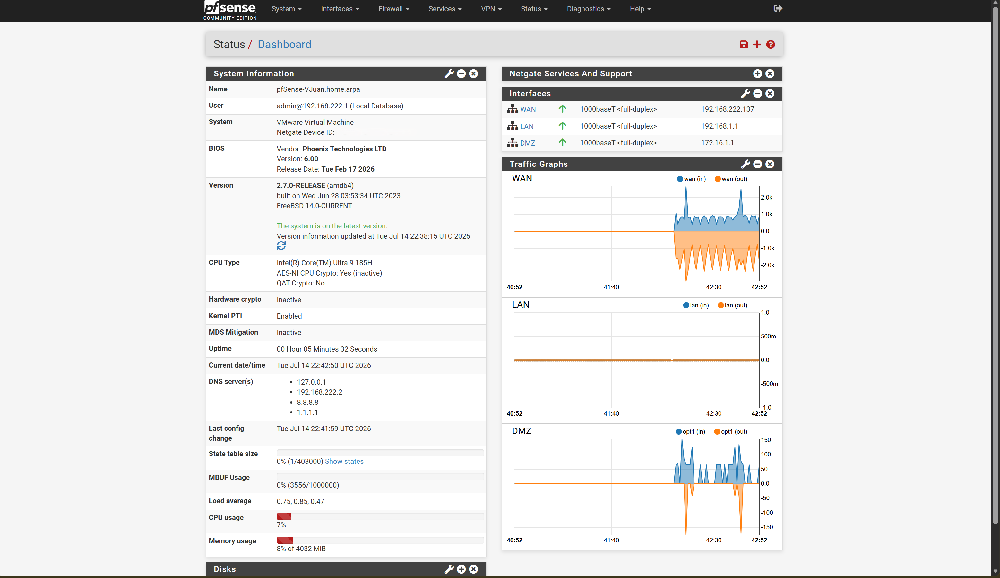
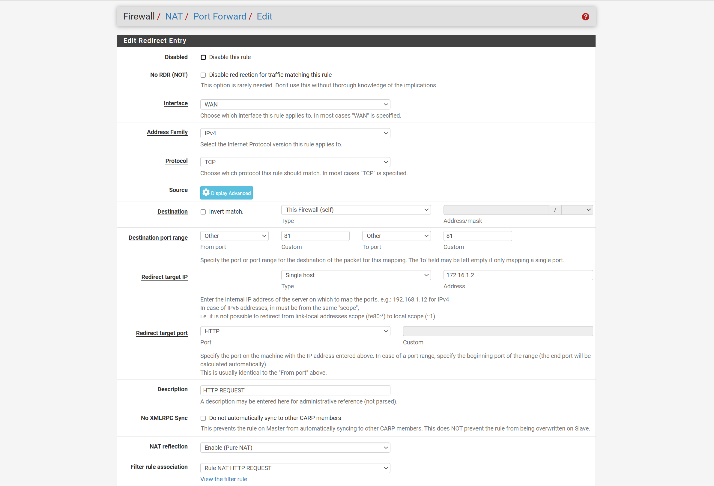
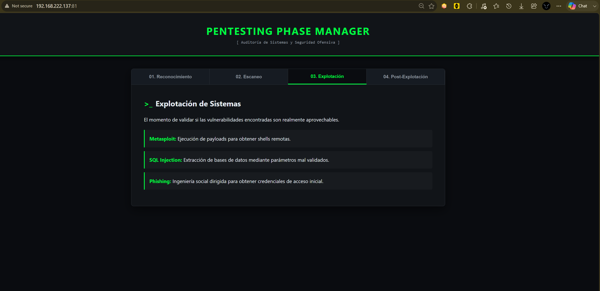
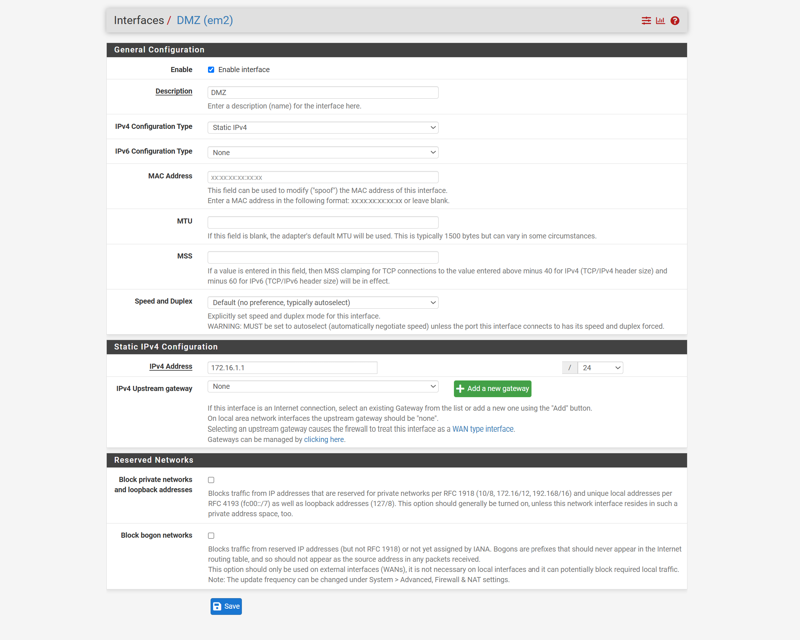
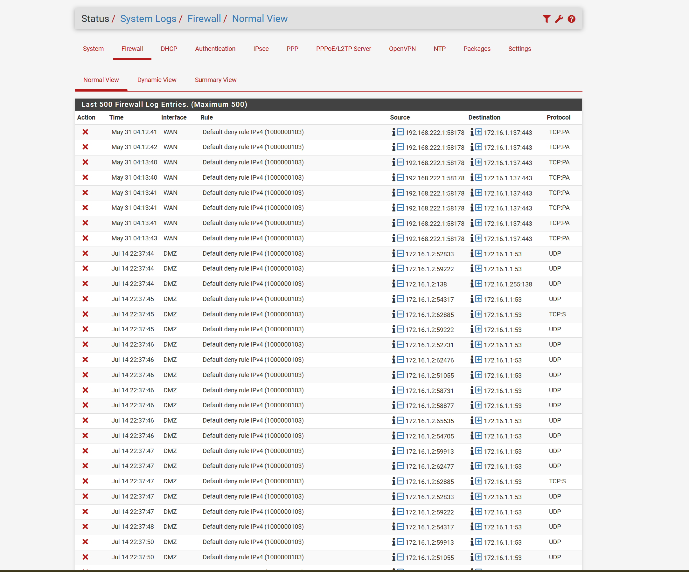
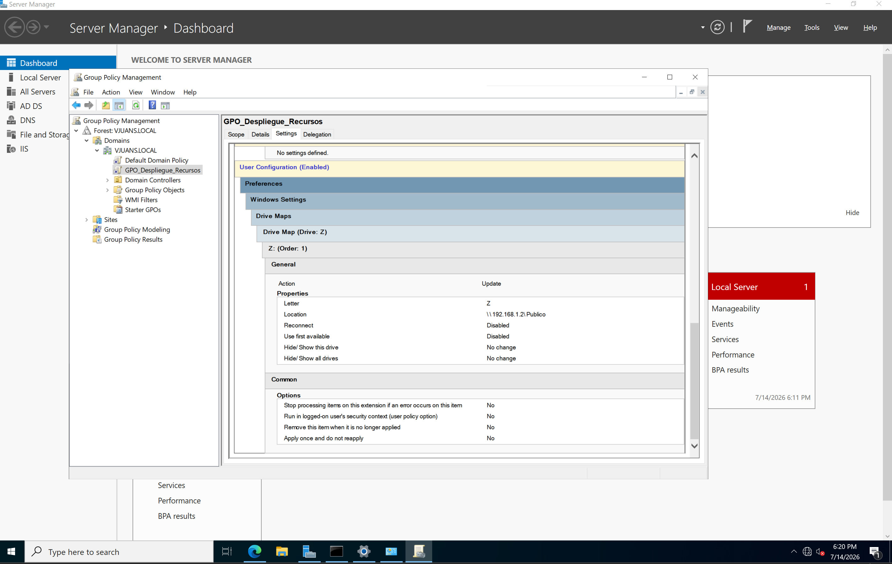

# pfSense UTM and Network Segmentation Lab

#### Implementation Status: Completed
#### Documentation Status: Published
#### Last Updated: July 2026

#### Difficulty: Intermediate
#### Category: Infrastructure Security
---

### Technologies

- pfSense 2.7.0
- VMware Workstation Pro
- Windows Server 2022
- Internet Information Services (IIS)
- Active Directory Domain Services
- DNS
- Group Policy Objects (GPO)
- Network Address Translation
- Port Forwarding
- Firewall Logging
---

## Project Highlights

- Deployed pfSense with dedicated WAN, LAN, and DMZ interfaces.
- Published an IIS web service through `WAN TCP/81 → DMZ TCP/80`.
- Applied default-deny firewall behavior and reviewed blocked traffic.
- Migrated the web service from the LAN to a dedicated DMZ segment.
- Configured Active Directory, DNS, and Group Policy concepts.
- Documented security findings, limitations, and remediation actions.
---
## Table of Contents

- [Project Overview](#project-overview)
- [Environment](#environment)
- [Network Topology](#network-topology)
- [Security Principles Applied](#security-principles-applied)
- [Implementation Process](#implementation-process)
- [Validation and Testing](#validation-and-testing)
- [Results](#results)
- [Visual Evidence](#visual-evidence)
- [Security Findings and Limitations](#security-findings-and-limitations)
- [Lessons Learned](#lessons-learned)
- [Future Improvements](#future-improvements)
- [References](#references)
---

## Project Overview

### Objective

Design and implement a virtualized edge-security environment using pfSense 2.7.0 as a perimeter firewall and UTM-capable platform.

The project focuses on traffic mediation between external and internal network segments, controlled service exposure through destination NAT and Port Forwarding, and network segmentation through dedicated WAN, LAN, and DMZ zones.

The environment was developed to evaluate perimeter security controls, firewall behavior, service-publication mechanisms, and administrative visibility within a simulated enterprise infrastructure.

### Context

Modern organizations require centralized mechanisms to control traffic entering and leaving their internal networks. Edge-security platforms provide capabilities such as stateful packet filtering, routing, NAT, network segmentation, and event logging from a centralized control point.

This laboratory documents the implementation of pfSense 2.7.0 as the security gateway between a simulated external network and protected internal segments. Windows Server 2022 provided the web and enterprise services required to validate controlled service exposure, DMZ segmentation, firewall enforcement, and policy-based resource administration.

IDS/IPS capabilities were considered as part of the broader UTM model but were not implemented during this phase of the laboratory.
---
## Environment

### Physical Host

- Lenovo Yoga Pro 9i
- Windows 11 Home
- VMware Workstation Pro 25H2

### pfSense Virtual Machine

- 4 GB RAM
- 1 vCPU
- 20 GB virtual disk
- Three virtual network adapters:
    - VMware NAT — WAN
    - VMnet1 Host-only — LAN
    - VMnet2 Host-only — DMZ

### Guest Systems

| System              | Primary Role                                               |
| ------------------- | ---------------------------------------------------------- |
| pfSense 2.7.0       | Firewall, router, NAT gateway, and network segmentation    |
| Windows Server 2022 | IIS web service, DNS, Active Directory, and GPO validation |

---
### Scope and Limitations

- The environment was deployed entirely through local virtualization.
- The WAN used a private VMware NAT network rather than a real public Internet connection.
- IDS/IPS functionality was not implemented during this phase.
- High Availability was conceptually evaluated but not deployed as a real redundant pfSense cluster.
- Some enterprise services were modeled within a limited number of virtual machines rather than separated into dedicated production-grade servers.
- The environment was designed for controlled academic testing and should not be interpreted as a production-ready architecture.

---

## Network Topology

### Architecture Overview

The environment was designed around a centralized pfSense appliance responsible for controlling traffic between the WAN, LAN, and DMZ segments.

The first phase used a two-zone WAN/LAN architecture. The environment was later expanded by adding a dedicated DMZ for the externally published IIS web service.

pfSense managed packet filtering, routing, NAT translation, Port Forwarding, and firewall logging. Windows Server 2022 provided the internal and published enterprise services required for validation.

### Network Segments
| Zone | Purpose                                                                             |
| ---- | ----------------------------------------------------------------------------------- |
| WAN  | Simulated external network representing Internet connectivity                       |
| LAN  | Protected internal network containing trusted resources and administrative services |
| DMZ  | Isolated network segment hosting publicly accessible services                       |

### IP Addressing

| Component          | Interface or Zone | Address          | Purpose                            |
| ------------------ | ----------------- | ---------------- | ---------------------------------- |
| VMware NAT Network | WAN               | 192.168.222.0/24 | Simulated external network         |
| pfSense            | WAN               | 192.168.222.137  | External-facing firewall interface |
| pfSense            | LAN               | 192.168.1.1/24   | LAN gateway                        |
| Initial IIS Server | LAN               | 192.168.1.2/24   | Initial internal web service       |
| pfSense            | DMZ               | 172.16.1.1/24    | DMZ gateway                        |
| IIS Server         | DMZ               | 172.16.1.2/24    | Final published web service        |

---
## Security Principles Applied

### Defense in Depth
Multiple security layers were applied through network segmentation, stateful packet filtering, NAT, service-specific rules, and firewall logging.

### Network Segmentation
The LAN and DMZ were placed in separate network segments to reduce the possibility of unrestricted lateral movement between public-facing and trusted systems.

### Least Privilege
Only the protocol and port required by the published web service were permitted from the WAN.

### Controlled Service Exposure
The IIS service was exposed through a specific Port Forwarding rule instead of granting direct external access to the internal network.

### Default-Deny Policy
Traffic that was not explicitly permitted by an applicable firewall rule was blocked by pfSense.

### Administrative Visibility
Firewall events and blocked connections were reviewed through the pfSense system logs to validate rule behavior.

---

## Implementation Process

### Installation

A dedicated virtual machine was created in VMware Workstation Pro for pfSense 2.7.0.

The VM was provisioned with 4 GB of RAM, one virtual CPU, a 20 GB virtual disk, and two initial virtual network adapters for WAN and LAN connectivity. The pfSense ISO image was mounted as the virtual installation media.

During installation, a GPT partition layout and a UFS root filesystem were configured. After the installation completed, the ISO was detached and the virtual machine was restarted from its virtual disk.

A third virtual network adapter was added later to support the dedicated DMZ segment.

### Initial Configuration

After the first boot, pfSense detected the WAN and LAN interfaces.

The WAN interface obtained the address `192.168.222.137` through DHCP from the VMware NAT network. The LAN interface was configured statically as `192.168.1.1/24`

The WebGUI setup wizard was used to configure:

- Hostname: `pfSense-VJuan`
- Primary DNS server: `8.8.8.8`
- Secondary DNS server: `1.1.1.1`
- LAN addressing
- Administrative access parameters

Because the simulated WAN used an RFC1918 private address, the option that blocks private networks on the WAN interface was disabled for the laboratory environment.

During troubleshooting, the command `pfctl -d` was temporarily used from the pfSense console to disable the Packet Filter and restore WebGUI access.

This command disables firewall filtering completely and therefore represents a significant security risk. It must only be used temporarily in an isolated laboratory and should be followed by re-enabling the Packet Filter after the administrative access problem has been resolved.

### Interface Configuration

The final architecture used three logical interfaces:

| Interface | VMware Network   | Address         | Function                 |
| --------- | ---------------- | --------------- | ------------------------ |
| WAN       | NAT              | 192.168.222.137 | External connectivity    |
| LAN       | VMnet1 Host-only | 192.168.1.1/24  | Trusted internal network |
| DMZ       | VMnet2 Host-only | 172.16.1.1/24   | Public service segment   |

During the initial phase, Windows Server 2022 was configured as:

- IP address: `192.168.1.2/24`
- Default gateway: `192.168.1.1`
- DNS server: `192.168.1.1`

During the DMZ phase, the published IIS service was moved to:
- IP address: `172.16.1.2/24`
- Default gateway: `172.16.1.1`

This required updating the existing NAT and Port Forwarding configuration to reference the new DMZ address.

### Firewall Rules

Firewall rules were created to control traffic between the WAN, LAN, and DMZ.

The WAN rules permitted only TCP traffic addressed to the published external port of the IIS service. No general WAN-to-LAN access was authorized.

The DMZ followed a default-deny approach toward the LAN. Traffic originating from the public-service segment was not permitted to reach trusted internal resources unless an explicit rule existed.

The rules were designed to:

- Limit external exposure to the required web service.
- Prevent unrestricted access from the DMZ to the LAN.
- Preserve stateful inspection of permitted connections.
- Generate logs for blocked and permitted traffic where required.

### NAT Configuration

pfSense performed address translation between the VMware WAN network and the internal segments.

The project used destination NAT through Port Forwarding. This allowed traffic addressed to a specific port on the pfSense WAN interface to be translated and forwarded to the IIS server.

NAT Reflection was enabled in Pure NAT mode during the laboratory to permit internal clients to test the published service using the WAN address.

This configuration was used for testing convenience and should be evaluated carefully before being implemented in a production environment.

### Port Forwarding

The initial rule forwarded traffic as follows:

```
WAN address: TCP/81
        ↓
192.168.1.2:80
```

After moving the IIS service to the DMZ, the rule was updated to:

```
WAN address: TCP/81
        ↓
172.16.1.2:80
```

Port `81` was used as the external listening port, while IIS continued to listen internally on the standard HTTP port `80`.

The rule was limited to TCP traffic and was associated with the corresponding WAN firewall permission.

This configuration represents Port Address Translation and Port Forwarding. It is not a one-to-one NAT mapping.

### Additional Services

#### Internet Information Services
IIS was installed on Windows Server 2022 and hosted the `Pentesting Phase Manager` web application used to validate external service publication.

#### Active Directory and DNS
Windows Server 2022 was used to evaluate Active Directory Domain Services and internal DNS capabilities within the enterprise-oriented phase of the laboratory.

#### Group Policy
A Group Policy Object was used to automate the mapping of a shared network resource, demonstrating centralized configuration management.

#### Firewall Logging
The pfSense firewall logs were reviewed to identify blocked traffic, validate default-deny behavior, and troubleshoot connectivity after the IIS service was moved to the DMZ.

---

## Validation and Testing

### Test Matrix

| ID  | Test                            | Procedure                                                                                       | Expected Result                                                  | Observed Result                                                                   | Status |
| --- | ------------------------------- | ----------------------------------------------------------------------------------------------- | ---------------------------------------------------------------- | --------------------------------------------------------------------------------- | ------ |
| T01 | Interface detection             | Review the pfSense console and dashboard after installation                                     | WAN and LAN interfaces are detected and assigned correctly       | WAN received `192.168.222.137` through DHCP and LAN was assigned `192.168.1.1/24` | Passed |
| T02 | Initial LAN connectivity        | Configure Windows Server with `192.168.1.2/24`, gateway `192.168.1.1`, and connect it to VMnet1 | The server communicates through pfSense as its default gateway   | Windows Server was successfully connected to the protected LAN segment            | Passed |
| T03 | Initial service publication     | Access `http://192.168.222.137:81` from the external host                                       | pfSense forwards TCP/81 to `192.168.1.2:80`                      | The IIS-hosted Pentesting Phase Manager application was displayed successfully    | Passed |
| T04 | DMZ segmentation behavior       | Move the published server to `172.16.1.2/24` before updating the existing Port Forwarding rule  | The previous publication rule no longer reaches the server       | External access stopped and firewall logs recorded blocked traffic                | Passed |
| T05 | Default-deny validation         | Review `Status > System Logs > Firewall` after the DMZ migration                                | Unpermitted traffic is blocked and logged                        | Multiple entries associated with the default IPv4 deny rule were observed         | Passed |
| T06 | Updated DMZ publication         | Update the Port Forwarding target to `172.16.1.2:80` and configure gateway/DNS as `172.16.1.1`  | External access to TCP/81 is restored through the DMZ            | The web application was displayed successfully after the configuration update     | Passed |
| T07 | Centralized resource deployment | Configure a GPO to map drive `Z:` to the shared resource | A drive-mapping policy is created and linked through Group Policy | The GPO was created and associated with the shared path; client-side application was not independently validated | Partially Validated |

### Testing Scope

The validation focused on functional connectivity, network segmentation, firewall enforcement, Port Forwarding behavior, and administrative visibility.

No formal throughput, latency, packet-loss, RTO, RPO, or availability measurements were recorded during this implementation. Results must therefore be interpreted as qualitative functional validation rather than a performance benchmark.

---

## Results

### Initial WAN-to-LAN Publication

The first implementation successfully exposed the IIS web application without granting direct access to the entire internal network.

Traffic arriving at the pfSense WAN address on TCP port `81` was translated and forwarded to TCP port `80` on the Windows Server instance located at `192.168.1.2`.

The successful display of the Pentesting Phase Manager application confirmed that:

- The Port Forwarding rule matched the expected traffic.
- The associated WAN firewall permission was operational.
- The Windows Server used pfSense as its default gateway.
- The internal server address was not directly exposed to the external segment.

### DMZ Migration and Default-Deny Behavior

After moving the published service from the LAN to the DMZ address `172.16.1.2`, external access stopped because the previous NAT target and network parameters were no longer valid.

The interruption was an expected security behavior rather than an application failure. Firewall logs showed that traffic without a matching permit rule was discarded by the default-deny policy.

This validated that:

- Network segments were independently controlled.
- Existing access was not automatically inherited after the service moved to another zone.
- New traffic paths required explicit configuration.
- Firewall logs provided useful troubleshooting and audit information.

### Restored Service Publication

The Port Forwarding destination was updated to the DMZ server address, and the server gateway and DNS configuration were adjusted to use `172.16.1.1`.

After applying these changes, access through `http://192.168.222.137:81` was restored successfully.

The final result demonstrated controlled publication of a DMZ-hosted service through a specific protocol and port while maintaining separation from the trusted LAN segment.

### Identity and Policy Management Validation

Active Directory, DNS, shared-resource configuration, and Group Policy were evaluated during the enterprise-services phase of the laboratory.

A GPO was created to automate the mapping of drive `Z:` to the shared network resource. This demonstrated centralized administration and policy-based resource deployment.

Because the laboratory used a limited number of virtual machines, permanent role separation between the Domain Controller and the public-facing IIS server was not fully validated. A production-oriented implementation would deploy these functions on separate systems and security zones.

---

## Visual Evidence

### 1. Operational pfSense Interfaces

The pfSense dashboard confirms that the WAN, LAN, and DMZ interfaces were enabled and operational.

The final interface addressing was:

* WAN: `192.168.222.137`
* LAN: `192.168.1.1/24`
* DMZ: `172.16.1.1/24`

The traffic graphs also provide visibility into activity passing through the WAN and DMZ interfaces.



---

### 2. Port Forwarding Rule

A destination NAT and Port Forwarding rule was configured on the WAN interface.

The rule received TCP traffic on external port `81` and redirected it to the IIS web service hosted in the DMZ at `172.16.1.2:80`.

NAT Reflection was enabled in Pure NAT mode for testing purposes, and an associated firewall rule was created to permit the matching traffic.



---

### 3. External Service Validation

The IIS-hosted Pentesting Phase Manager application was successfully accessed through the pfSense WAN address:

```text
http://192.168.222.137:81
```

This result confirmed the functional operation of:

* The Port Forwarding rule.
* The associated WAN firewall permission.
* The route between the WAN and DMZ.
* The IIS web service on TCP port `80`.
* The DMZ server gateway configuration.

The browser identified the connection as not secure because the service was published over HTTP rather than HTTPS. Transport encryption remains a future improvement.



---

### 4. DMZ Interface Configuration

A dedicated DMZ interface was enabled in pfSense using static IPv4 addressing.

The interface was assigned:

```text
Interface: DMZ
IPv4 address: 172.16.1.1/24
Upstream gateway: None
```

This interface operated as the default gateway for the public-facing server segment.



---

### 5. Default-Deny Firewall Logging

The pfSense firewall logs recorded traffic rejected by the default IPv4 deny rule.

The displayed events include traffic originating from the DMZ server at `172.16.1.2` toward services on the pfSense DMZ interface, including DNS traffic addressed to `172.16.1.1:53`.

This evidence demonstrates that traffic without an explicit matching permit rule was denied and recorded for administrative review.

It should not, by itself, be interpreted as proof of a specific DMZ-to-LAN blocking test because the displayed destination is the pfSense DMZ interface.



---

### 6. Group Policy Resource Deployment

A Group Policy Object named `GPO_Despliegue_Recursos` was configured to map drive `Z:` to the shared network resource:

```text
\\192.168.1.2\Publico
```

This configuration demonstrated centralized resource deployment through Active Directory and Group Policy during the enterprise-services phase of the laboratory.




---

## Security Findings and Limitations

|Finding|Relative Severity|Impact|Recommended Remediation|
|---|---|---|---|
|Packet Filter temporarily disabled with `pfctl -d`|High|Disables firewall enforcement and may expose all reachable services|Use LAN-based administration, validate anti-lockout rules, correct interface assignments, and re-enable filtering immediately after troubleshooting|
|Default administrative credentials retained during the lab|High|Allows unauthorized administrative access if the interface becomes reachable|Replace default credentials with a unique strong password before enabling normal connectivity|
|IIS service published through unencrypted HTTP|Medium|Application traffic can be observed or modified in transit|Implement HTTPS with a trusted or laboratory certificate and redirect HTTP to HTTPS|
|Public and identity-management roles not permanently separated|Medium|Compromise of the web role could affect domain or administrative services|Deploy IIS and AD DS on separate virtual machines and keep the Domain Controller exclusively in the LAN|
|No IDS/IPS implementation|Medium|Malicious traffic is filtered only through firewall rules without signature-based detection|Integrate Suricata or Snort and define alerting and tuning procedures|
|No centralized log collection|Medium|Events remain distributed and are harder to correlate|Forward pfSense and Windows logs to a SIEM or centralized syslog platform|
|External port `81` used instead of `80`|Informational|Changes the service entry point but does not provide meaningful security by itself|Treat nonstandard ports as an operational choice, not as a security control|

---

## Lessons Learned

### Technical Knowledge Acquired

- Understood how pfSense performs stateful packet filtering and destination NAT.
- Implemented Port Forwarding with translation between different external and internal ports.
- Configured WAN, LAN, and DMZ interfaces in a virtualized environment.
- Applied a default-deny approach between network segments.
- Used firewall logs to analyze blocked connections and troubleshoot routing problems.
- Reinforced the importance of correct IP address, gateway, DNS, and network-adapter configuration.
- Evaluated centralized identity, DNS, and Group Policy concepts using Windows Server 2022.
- Distinguished between functional service publication and complete production-grade security architecture.

### Challenges Encountered

#### WebGUI Access

Administrative access to the pfSense WebGUI was initially affected by firewall and interface configuration. The Packet Filter was temporarily disabled through `pfctl -d` to recover access.

Although this allowed troubleshooting to continue, it also removed firewall enforcement and represented a significant security risk.

#### External Port Conflict

The external use of TCP port `80` did not operate as expected in the laboratory. TCP port `81` was therefore selected as the external listening port while IIS continued listening on TCP port `80`.

#### Service Migration to the DMZ

Moving the server from `192.168.1.2` to `172.16.1.2` caused the existing publication rule to become invalid. The server also required a new default gateway and DNS configuration.

#### Architecture Constraints

The limited number of virtual machines restricted the ability to demonstrate permanent separation between the public web server and identity-management services.

### Solutions Applied

- Reviewed pfSense interface and firewall behavior from the console and WebGUI.
- Used temporary Packet Filter deactivation only as a troubleshooting mechanism.
- Published the web service through the mapping `WAN TCP/81 → internal TCP/80`.
- Added a third VMware network adapter for the DMZ.
- Configured the DMZ gateway as `172.16.1.1/24`.
- Updated the Port Forwarding destination to `172.16.1.2`.
- Updated the Windows Server gateway and DNS configuration.
- Reviewed firewall logs to identify default-deny events.
- Revalidated external HTTP access after every architectural change.

---

## Key Takeaways

- A firewall rule and a NAT rule solve related but different requirements and must be configured coherently.
- Moving a service between security zones requires reviewing addressing, routing, DNS, NAT, and firewall policies.
- Default-deny behavior is a security control that may initially appear as a connectivity failure.
- Firewall logs are essential for distinguishing routing, translation, and policy-enforcement problems.
- A DMZ provides meaningful isolation only when public and trusted roles are hosted on separate systems.
- Nonstandard ports do not replace authentication, encryption, filtering, or system hardening.
- Professional documentation must record limitations and insecure troubleshooting decisions, not only successful results.

---

## Future Improvements

### Architecture

- Separate the Domain Controller, DNS service, and IIS web server into dedicated virtual machines.
- Maintain the Domain Controller in the trusted LAN and the IIS server exclusively in the DMZ.
- Add a dedicated administrative workstation or management network.
- Develop and include a formal network-topology diagram.

### Security

- Replace all default credentials.
- Implement HTTPS using certificate-based encryption.
- Add Suricata or Snort for IDS/IPS capabilities.
- Apply explicit egress rules from the DMZ.
- Integrate centralized logging with a SIEM or syslog platform.
- Perform vulnerability scanning against the DMZ service.
- Document a formal firewall-rule review process.

### Availability

- Deploy a second pfSense node and evaluate CARP-based High Availability.
- Add redundant IIS servers and a reverse proxy or load balancer.
- Define and measure RTO, RPO, uptime, latency, and packet-loss metrics.
- Implement tested backup and recovery procedures.

### Remote Access

- Deploy a VPN for secure administrative access.
- Restrict WebGUI administration to trusted management addresses.
- Evaluate certificate-based authentication and multi-factor authentication.
---

## References

- Netgate. _pfSense Documentation_.
- Microsoft Learn. _Windows Server 2022, Active Directory Domain Services, DNS, IIS, and Group Policy Documentation_.
- VMware. _VMware Workstation Pro Documentation_.
- Sol Llaven, D. _Sistemas operativos: panorama para la ingeniería en computación e informática_.
- Tanenbaum, A. S. _Sistemas operativos modernos_.
